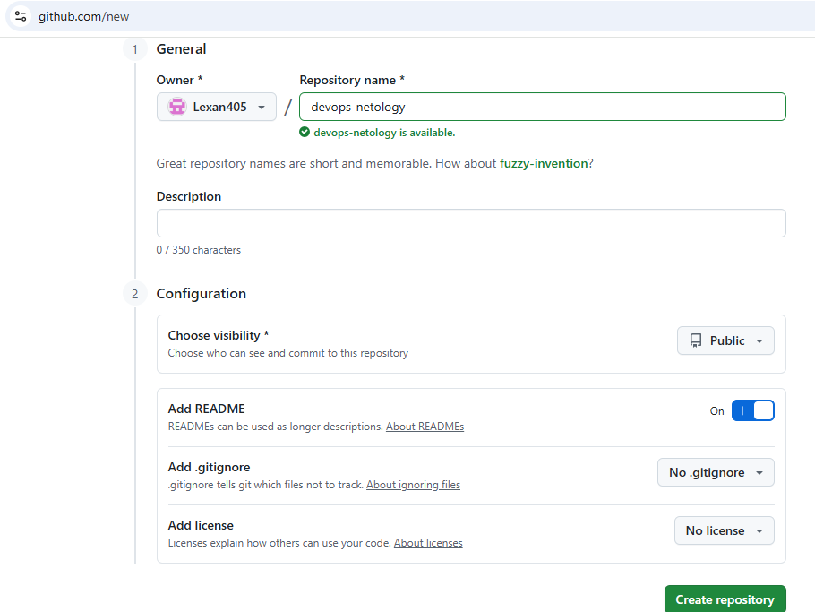
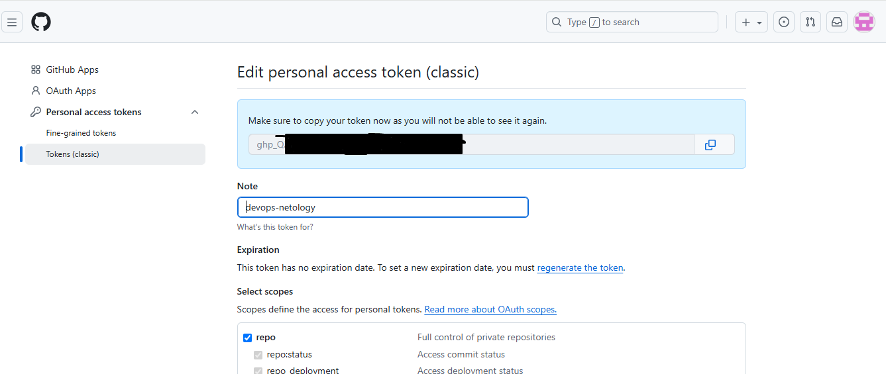
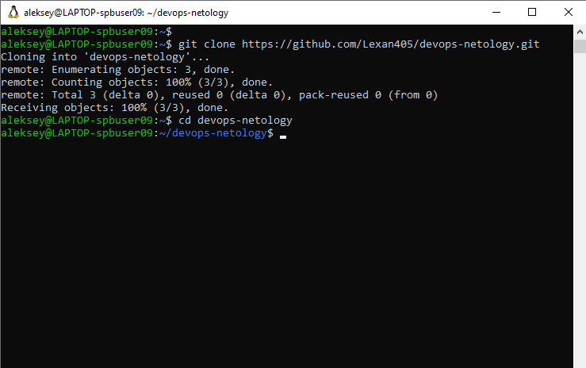
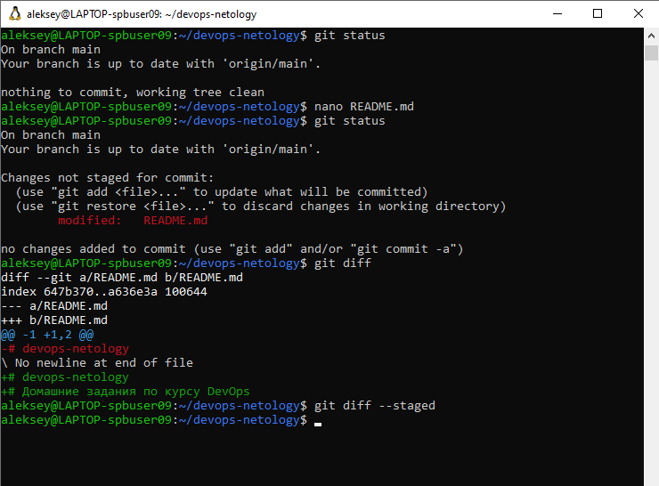
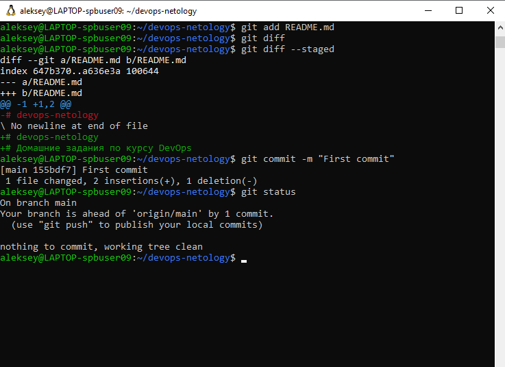
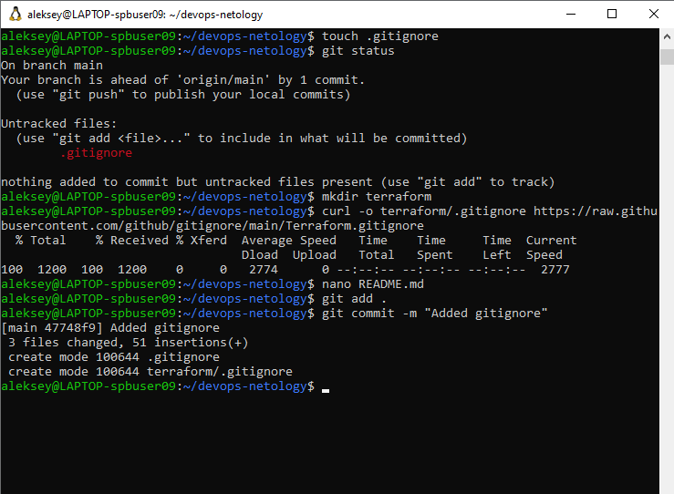
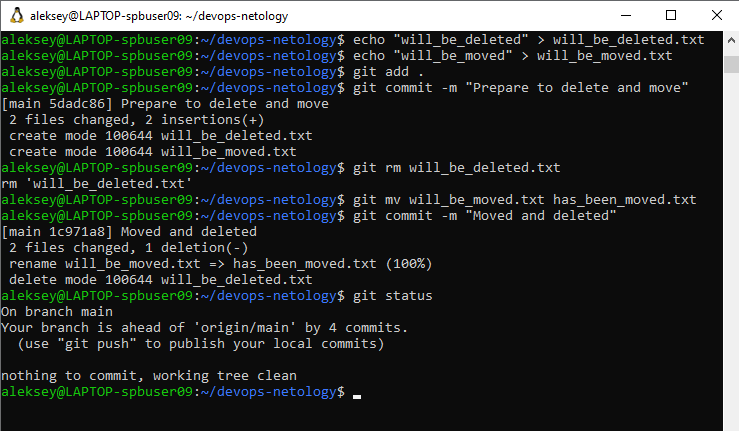
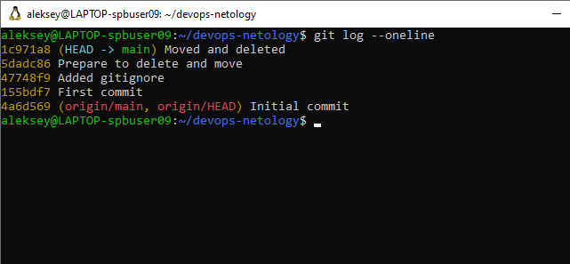

# devops-netology
# Домашние задания по курсу DevOps

## .gitignore

Файл `.gitignore` в корне и в папке `terraform/` исключает из отслеживания:
- локальные файлы состояния Terraform (.tfstate, .tfstate.backup)
- секреты (файлы с расширением .tfvars, если они содержат чувствительные данные)
- временные и скомпилированные файлы (например, .terraform/ директорию)

# Создание репозитория

# Создание токена

# Клонирование репозитория

# Изменения статуса

# Первый коммит

# Создание .gitignore

# Удаление и перемешение

# Логи

